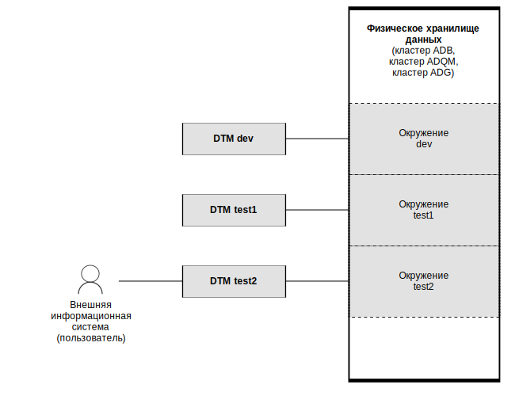

---
layout: default
title: Окружение
nav_order: 3
parent: Основные понятия
grand_parent: Обзор понятий, компонентов и связей
has_children: false
has_toc: false
---

# Окружение

_Окружение_ — совокупность логических баз данных, доступных при работе с системой. Инсталляция системы работает 
с окружением, заданным в ее конфигурации.

Допустимо создавать несколько окружений для одного набора кластеров СУБД и при необходимости перенастраивать
инсталляцию системы на другое окружение. Попеременное использование независимых окружений может быть полезно,
например, в случае разделения различных тестовых сред.

На рисунке ниже показан пример инсталляции системы с тремя окружениями, где в текущий момент внешняя информационная
система работает с окружением test2.

{:.image-caption}
*Инсталляция системы с тремя окружениями*