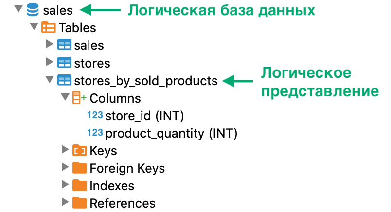

---
layout: default
title: Создание логического представления
nav_order: 5
parent: Управление схемой данных
grand_parent: Работа с системой
has_children: false
---

Создание логического представления
==================================

Логическое представление можно создать на основе данных одной или нескольких логических таблиц.

Чтобы создать [логическое представление](../../../Обзор_понятий_компонентов_и_связей/Основные_понятия/Логическое_представление/Логическое_представление.md) 
в [логической БД](../../../Обзор_понятий_компонентов_и_связей/Основные_понятия/Логическая_база_данных/Логическая_база_данных.md), 
выполните запрос [CREATE VIEW](../../../Справочная_информация/Запросы_SQLplus/CREATE_VIEW/CREATE_VIEW.md) 
(см. пример [ниже](<LINK>)). При успешном выполнении запроса в 
[логической схеме данных](../../../Обзор_понятий_компонентов_и_связей/Основные_понятия/Логическая_схема_данных/Логическая_схема_данных.md) 
появляется новое логическое представление.

Чтобы проверить наличие логического представления, используйте любой из способов:

*   выполните запрос метаданных логической схемы данных 
    (см. [Запрос метаданных логической схемы](../Запрос_метаданных_логической_схемы/Запрос_метаданных_логической_схемы.md)),

*   выполните запрос [SELECT](../../../Справочная_информация/Запросы_SQLplus/SELECT/SELECT.md) 
    к логическому представлению,

*   проверьте дерево объектов в вашем SQL-клиенте (см. рисунок ниже).


На рисунке ниже показан фрагмент дерева объектов SQL-клиента, которое содержит логическое представление 
`stores_by_sold_products`.



#### Пример
```sql
-- выбор базы данных sales по умолчанию
USE sales

-- создание представления stores\_by\_sold\_products
CREATE VIEW stores\_by\_sold\_products AS
SELECT store\_id, SUM(product\_units) AS product\_quantity
FROM sales.sales
GROUP BY store\_id
ORDER BY product\_amount DESC
LIMIT 30

-- проверка наличия логического представления stores\_by\_sold\_products
SELECT
CASE
WHEN count(\*) > 0 THEN 'представление существует'
ELSE 'представления не существует'
END
FROM INFORMATION\_SCHEMA.tables
WHERE table\_schema = 'SALES' AND table\_name = 'STORES\_BY\_SOLD\_PRODUCTS'
```