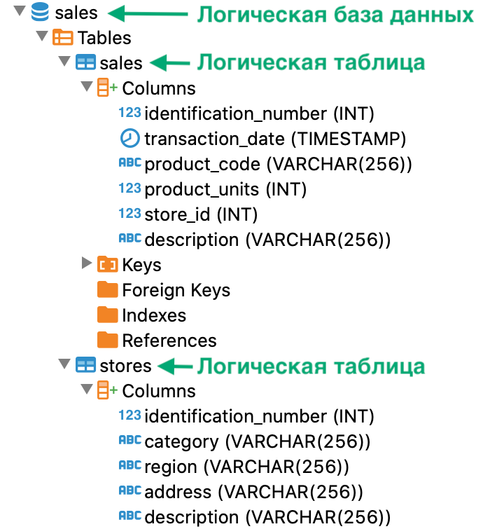

---
layout: default
title: Создание логической таблицы
nav_order: 3
parent: Управление схемой данных
grand_parent: Работа с системой
has_children: false
---

Создание логической таблицы
===========================

Чтобы создать [логическую таблицу](../../../Обзор_понятий_компонентов_и_связей/Основные_понятия/Логическая_таблица/Логическая_таблица.md) 
в [логической базе данных](../../../Обзор_понятий_компонентов_и_связей/Основные_понятия/Логическая_база_данных/Логическая_база_данных.md), 
выполните запрос [CREATE TABLE](../../../Справочная_информация/Запросы_SQLplus/CREATE_TABLE/CREATE_TABLE.md) 
(см. пример [ниже](<LINK>)). При успешном выполнении запроса в 
[логической схеме данных](../../../Обзор_понятий_компонентов_и_связей/Основные_понятия/Логическая_схема_данных/Логическая_схема_данных.md) 
появляется новая логическая таблица.

Чтобы проверить наличие логической таблицы, используйте любой из способов:

*   выполните запрос метаданных логической схемы данных 
    (см. [Запрос метаданных логической схемы](../Запрос_метаданных_логической_схемы/Запрос_метаданных_логической_схемы.md)),

*   выполните запрос [SELECT](../../../Справочная_информация/Запросы_SQLplus/SELECT/SELECT.md) к логической 
    таблице,

*   проверьте дерево объектов в вашем SQL-клиенте (см. рисунок ниже).


На рисунке ниже показан фрагмент дерева объектов, которое содержит логические таблицы `sales` и `stores`, 
в SQL-клиенте.



#### Пример
```sql
-- выбор базы данных sales по умолчанию
USE sales

-- создание таблицы sales
CREATE TABLE sales (
identification\_number INT NOT NULL,
transaction\_date TIMESTAMP NOT NULL,
product\_code VARCHAR(256) NOT NULL,
product\_units INT NOT NULL,
store\_id INT NOT NULL,
description VARCHAR(256),
PRIMARY KEY (identification\_number)
)
DISTRIBUTED BY (identification\_number)

-- проверка наличия логической таблицы sales
SELECT
CASE
WHEN count(\*) > 0 THEN 'таблица существует'
ELSE 'таблицы не существует'
END
FROM INFORMATION\_SCHEMA.tables
WHERE table\_schema = 'SALES' AND table\_name = 'SALES'
```

