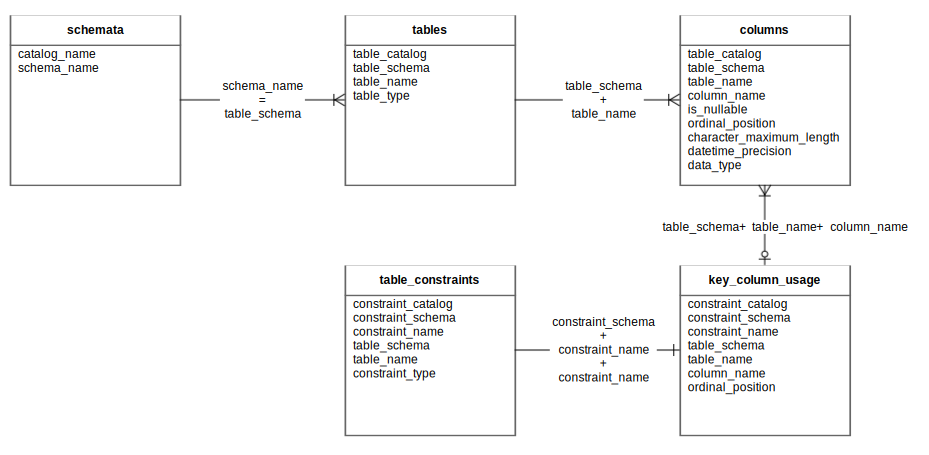

---
layout: default
title: Системные представления (INFORMATION_SCHEMA)
nav_order: 7
parent: Справочная информация
has_children: false
---

# Системные представления (INFORMATION_SCHEMA)

Набор системных представлений (INFORMATION_SCHEMA) предоставляет доступ к метаданным 
[логической схемы данных](../../Обзор_понятий_компонентов_и_связей/Основные_понятия/Логическая_схема_данных/Логическая_схема_данных.md) 
и содержит следующие элементы:
*   [schemata](#schemata),
*   [tables](#tables),
*   [columns](#columns),
*   [table_constraints](#table_constraints),
*   [key_column_usage](#key_column_usage).

Набор системных представлений и их свойств фиксирован и недоступен для изменения.

## schemata

Системное представление `schemata` содержит список [логических баз данных](../../Обзор_понятий_компонентов_и_связей/Основные_понятия/Логическая_база_данных/Логическая_база_данных.md) 
[окружения](../../Обзор_понятий_компонентов_и_связей/Основные_понятия/Окружение/Окружение.md). 
По каждой логической базе доступна следующая информация:
*   `catalog_name` — наименование каталога, в который помещена логическая база данных. Значение 
    по умолчанию — public;
*   `schema_name` — наименование логической базы данных.

## tables

Системное представление `tables` содержит список [логических таблиц](../../Обзор_понятий_компонентов_и_связей/Основные_понятия/Логическая_таблица/Логическая_таблица.md) 
и [представлений](../../Обзор_понятий_компонентов_и_связей/Основные_понятия/Логическое_представление/Логическое_представление.md) 
окружения. По каждой таблице или представлению доступна следующая информация:
*   `table_catalog` — наименование каталога, в который помещена таблица или представление. 
    Значение по умолчанию — public;
*   `table_schema` — наименование логической базы данных, к которой относится таблица или представление;
*   `table_name` — наименование таблицы или представления;
*   `table_type` — тип объекта. Возможные значения: BASE_TABLE — логическая таблица, VIEW — логическое 
    представление.

## columns

Системное представление `columns` содержит список столбцов логических таблиц и представлений окружения. 
По каждому столбцу доступна следующая информация:
*   `table_catalog` — наименование каталога, в который помещена таблица или представление. Значение 
    по умолчанию — public;
*   `table_schema` — наименование логической базы данных, к которой относится таблица или представление;
*   `table_name` — наименование таблицы или представления, к которому относится столбец;
*   `column_name` — наименование столбца, по которому предоставлена информация;
*   `is_nullable` — признак того, может ли значение столбца иметь пустое значение (null). Возможные 
    значения: YES — столбец может содержать пустое значение; NO — столбец должен содержать непустое 
    значение;
*   `ordinal_position` — порядковый номер столбца в таблице или представлении (нумерация начинается с 1);
*   `character_maximum_length` — максимально допустимое количество символов (для строковых значений);
*   `datetime_precision` — степень отображаемой точности значений типа TIMESTAMP. Возможное значение: 
    от 0 (точность до секунд) до 6 (точность до микросекунд).
*   `data_type` — тип данных столбца. Возможные значения см. в разделе [Логические типы данных](../Поддерживаемые_типы_данных/Логические_типы_данных/Логические_типы_данных.md).

## table_constraints

Системное представление `table_constraints` содержит список ограничений логических таблиц и представлений 
окружения. По каждому ограничению доступна следующая информация:
*   `constraint_catalog` — наименование каталога, в который помещена таблица или представление 
    с ограничением. Значение по умолчанию — public;
*   `constraint_schema` — наименование логической базы данных, к которой относится таблица или 
    представление с ограничением;
*   `constraint_name` — наименование ограничения;
*   `table_schema` — наименование логической базы данных, к которой относится таблица или представление 
    с ограничением;
*   `table_name` — наименование таблицы или представления, к которому относится ограничение;
*   `constraint_type` — тип ограничения. Возможные значения: primary key — первичный ключ, sharding key — 
    ключ шардирования.
    
## key_column_usage

Системное представление `key_column_usage` содержит список столбцов окружения, с которыми связаны 
какие-либо ограничения. По каждому столбцу доступна следующая информация:
*   `constraint_catalog` — наименование каталога, в который помещена таблица или представление 
    с ограничением. Значение по умолчанию — public;
*   `constraint_schema` — наименование логической базы данных, к которой относится таблица 
    или представление с ограничением;
*   `constraint_name` — наименование ограничения;
*   `table_schema` — наименование логической базы данных, к которой относится таблица или представление 
    с ограничением;
*   `table_name` — наименование таблицы или представления, к которому относится ограничение;
*   `column_name` — наименование столбца, на который накладывается ограничение;
*   `ordinal_position` — порядковый номер поля в ключе (нумерация начинается с 1).

## Взаимосвязь системных представлений

На рисунке ниже показана взаимосвязь системных представлений.

{: .figure-center}
*Взаимосвязь системных представлений*
{: .caption-center}